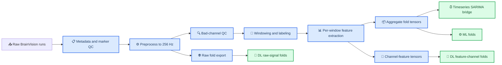

# Seizure detection using ECoG workspace

Quick report for a repo-local `ds003029` workspace that benchmarks three modeling directions from the same curated ECoG/iEEG subset: **timeseries**, **machine learning**, and **deep learning**.

The repository is now self-contained: raw data lives under `EEG/ds003029/`, generated artifacts live under `eda_outputs/`, and task wrappers live under `tools/`.

---

## 📋 Table of contents

- [At a glance](#-at-a-glance)
- [Experiment results](#-experiment-results)
- [Dataset](#-dataset)
- [Data processing](#-data-processing)
- [Methodology](#-methodology)
- [Quick setup](#-quick-setup)
- [Run experiments](#-run-experiments)
- [Workspace outputs](#-workspace-outputs)
- [Related documents](#-related-documents)

---

## 📋 At a glance

| Direction | Primary question | Main input artifact | Analysis unit | Split and evaluation | Best current result | Best use case |
| --- | --- | --- | --- | --- | --- | --- |
| **Timeseries** | Can a scalar signal derived from each run be forecast and flagged for anomalies over time? | `eda_outputs/data_processing_v2/sarima/ds003029_sarima_v2_input.csv` | One chronological window row within one run | Chronological train and test split inside each run | `sarimax_hjorth` has the lowest RMSE mean at `3.6159e-08`; `sarimax_rms_std` has the lowest sMAPE mean at `34.5963` | Run-level temporal baselines, residual analysis, anomaly-style inspection |
| **ML** | Can hand-crafted aggregate features classify seizure windows across held-out subjects? | `eda_outputs/data_processing_v2/folds/<fold_id>/{train,test}_dataset.npz` with `x_agg` | One labeled 2-second window with 48 aggregate features | Leave-one-subject-out folds plus grouped and stratified inner tuning | `catboost` reaches ROC-AUC `0.8799`, AP `0.8723`, F1 `0.6531` | Strongest current baseline on the curated subset |
| **DL** | Can channel-feature tensors or raw signal windows learn seizure patterns directly? | Feature-channel folds from `folds/` and raw folds from `raw_folds/` | One labeled 2-second window as a tensor | Same leave-one-subject-out fold structure reused from ML | `ce_tss_transformer` reaches ROC-AUC `0.8591`, AP `0.7752`, F1 `0.6218` | Higher-capacity models when channel structure or raw signal structure matters |

> **Important:** timeseries metrics such as RMSE, MAE, sMAPE, and $R^2$ do **not** measure the same task as ML and DL metrics such as ROC-AUC, average precision, and F1. Treat timeseries as a separate forecasting track, not as a directly comparable classifier leaderboard.

---

## 📊 Experiment results

The current workspace contains completed outputs for all three directions and passes the repo-local verification sweep.

| Scope | Current status |
| --- | --- |
| Total experiments checked | `21` |
| Timeseries presets | `4` |
| ML presets | `5` |
| DL presets | `12` |
| Verification errors | `0` |
| Verification warnings | `0` |

### Result snapshot by direction

| Direction | Leader | Key metrics | Interpretation |
| --- | --- | --- | --- |
| **Timeseries** | `sarimax_hjorth` and `sarimax_rms_std` | Lowest RMSE mean: `3.6159e-08`; lowest sMAPE mean: `34.5963` | Best read as a run-level forecasting baseline, not as a seizure classifier |
| **ML** | `catboost` | ROC-AUC `0.8799`, AP `0.8723`, F1 `0.6531`, precision `0.7308`, sensitivity `0.7248`, specificity `0.8315`, accuracy `0.7620` | Strongest overall direction on the current curated subset |
| **DL** | `ce_tss_transformer` | ROC-AUC `0.8591`, AP `0.7752`, F1 `0.6218`, precision `0.6534`, sensitivity `0.6976`, specificity `0.7957`, accuracy `0.7416` | Best deep-learning result, but still behind the top ML baseline |

### What stands out

- **Timeseries** is useful for temporal reconstruction and anomaly-oriented summaries, but it is not the primary seizure classification winner in this workspace.
- **ML** currently wins because the curated dataset is still small enough that strong hand-crafted features plus LOSO evaluation remain highly effective.
- **DL** is competitive when the model can exploit channel structure, but weaker raw-signal adapters such as `bendr`, `biseizurere_proxy`, and `reve` show that not every architecture benefits equally from the current data scale.

### One command for all result summaries

```bash
python3 tools/workspace_reports.py summarize --family all --workspace-root /path/to/Seizure-Dectection-using-ECoG-
```

### One command for all result verification

```bash
python3 tools/workspace_reports.py verify --family all --workspace-root /path/to/Seizure-Dectection-using-ECoG-
```

---

## 🗂 Dataset

This workspace is built around OpenNeuro `ds003029`, a BIDS-formatted iEEG/ECoG dataset with BrainVision recordings, channel metadata, and event markers. The full dataset context is larger than the actively modeled subset in this repository, so it is useful to separate **dataset reference scope** from **current modeling scope**.

| Item | Current workspace value | Why it matters |
| --- | --- | --- |
| Source dataset | `ds003029` | Shared upstream source for all three directions |
| Readable event inventory | `106` runs with readable `events.tsv` | Metadata and seizure interval QC pool |
| Modeling-ready subset | `16` runs across `8` subjects | Actual subset used to build folds and experiments |
| Post-preprocess sampling rate | `256 Hz` | Shared signal rate for downstream artifacts |
| Window length | `2.0 s` | Shared unit for seizure windows |
| Window step | `0.5 s` | Shared temporal stride |
| Boundary margin | `0.5 s` | Shared exclusion rule around onset and offset |

### Current class balance

The current labeled window inventory is:

- Total windows: `7646`
- Ictal windows: `3102`
- Interictal windows: `4480`
- Dropped boundary windows: `64`

### How each direction sees the same dataset

| Direction | What it consumes from the dataset | Practical view of the data |
| --- | --- | --- |
| **Timeseries** | One scalar target per chronological window row plus optional exogenous columns | A per-run forecasting table where order matters most |
| **ML** | `x_agg` with shape `(N, 48)` | A tabular seizure-window classification problem |
| **DL** | `x_channel` with shape `(N, max_channels, 16)` or `x_raw` with shape `(N, max_channels, n_samples)` | A tensor learning problem over channels or raw signal |

### One command to refresh dataset manifests for the full workspace

```bash
python3 tools/workspace_content.py --workspace-root /path/to/Seizure-Dectection-using-ECoG-
```

That command refreshes:

- `ds003029_run_summary.csv`
- `ds003029_marker_qc_by_run.csv`
- `ds003029_seizure_intervals_by_run.csv`
- `ds003029_content_run_manifest.csv`
- `ds003029_model_ready_run_manifest.csv`

---

## ⚙️ Data processing

All three directions share the same front half of the pipeline: metadata refresh, preprocessing, channel QC, windowing, and feature extraction. They diverge only at the last-mile artifact stage.



### Direction-specific outputs

| Direction | Shared upstream artifacts | Final family-specific artifact |
| --- | --- | --- |
| **Timeseries** | Preprocessed runs plus aggregate features | `eda_outputs/data_processing_v2/sarima/ds003029_sarima_v2_input.csv` |
| **ML** | Preprocessed runs plus aggregate features | `eda_outputs/data_processing_v2/folds/<fold_id>/{train,test}_dataset.npz` with `x_agg` |
| **DL** | Preprocessed runs plus aggregate features and optional raw exports | `eda_outputs/data_processing_v2/folds/` for feature-channel DL and `eda_outputs/data_processing_v2/raw_folds/` for raw-signal DL |

### What is shared and what is different

| Step | Timeseries | ML | DL |
| --- | --- | --- | --- |
| Preprocessing | Shared | Shared | Shared |
| Window labels | Shared | Shared | Shared |
| Aggregate features | Shared | Shared | Shared for feature-channel DL |
| SARIMA-ready CSV | Yes | No | No |
| LOSO fold NPZ | No direct use | Yes | Yes |
| Raw fold export | No | No | Yes for raw-signal models |

### One command to rebuild the shared processing backbone for all three directions

```bash
python3 tools/run_data_processing_v2.py full --workspace-root /path/to/Seizure-Dectection-using-ECoG- --artifact-subdir data_processing_v2 --overwrite
```

That command rebuilds the shared preprocessing, QC, windowing, and feature backbone used by **timeseries**, **ML**, and **DL**. For the full end-to-end family-specific outputs and training flow, use the one-command workspace rerun in [Run experiments](#-run-experiments).

---

## 🧠 Methodology

The three directions answer related but different questions, so the methodology should be compared side by side rather than merged into one generic modeling story.

### Shared methodological rules

- Binary window labels: `1=ictal`, `0=interictal`, `-1=boundary`
- Train-only normalization inside each fold where applicable
- Subject-aware evaluation for ML and DL
- Repo-local artifacts under `eda_outputs/`

### Family-by-family methodology

| Direction | Core method | Input representation | Validation logic | Strength | Main limitation |
| --- | --- | --- | --- | --- | --- |
| **Timeseries** | SARIMA or SARIMAX over a scalar target such as `rms` | Chronological rows per run with optional exogenous columns | Train and test split chronologically inside each run | Preserves temporal order and supports residual analysis | Not directly optimized for seizure classification metrics |
| **ML** | Gradient boosting, stacking, and SVM over aggregate features | `x_agg` with 48 dimensions built from 16 per-channel features and `mean/std/max` reducers | Leave-one-subject-out outer evaluation plus grouped and stratified inner tuning | Strongest performance on the current curated subset | Depends on hand-crafted feature engineering |
| **DL** | Architecture-faithful adapters over feature-channel tensors or raw windows | `x_channel` or `x_raw` tensors plus masks | Same LOSO fold separation as ML | Can exploit channel structure and richer representation learning | More sensitive to data scale, implementation fidelity, and compute |

### Feature inventory used by ML and part of DL

Per-channel feature families include:

- Time-domain: `rms`, `line_length`, `hjorth_activity`, `hjorth_mobility`, `hjorth_complexity`, `zero_crossing_rate`, `kurtosis`, `skewness`
- Frequency-domain: `delta_power`, `theta_power`, `alpha_power`, `beta_power`, `gamma_low_power`, `gamma_high_power`, `spectral_entropy`, `peak_frequency`

The strongest aggregate separators in the current workspace are dominated by `beta_power`, `gamma_low_power`, and `line_length`, which helps explain why the ML track is so strong.

### Model fidelity note

- **Timeseries** and **ML** are mostly direct library-backed implementations.
- **DL** models are mostly architecture-faithful repository adapters rather than byte-for-byte reproductions of upstream training pipelines.
- `biseizurere_proxy` is explicitly a surrogate adapter, not a source-faithful public reimplementation.

---

## 🚀 Quick setup

Use `python3` in this workspace. Some environments still map `python` to Python 2, so the quick path below assumes `python3` explicitly.

### Prerequisites

| Requirement | Recommendation | Check command |
| --- | --- | --- |
| Python | `python3` on PATH | `python3 --version` |
| Package installer | `pip` for the same interpreter | `python3 -m pip --version` |
| Optional environment | Conda or venv | `conda --version` or `python3 -m venv --help` |

### One-command install

```bash
python3 -m pip install -r requirements.txt
```

### Optional one-command health check

```bash
python3 tools/workspace_reports.py verify --family all --workspace-root /path/to/Seizure-Dectection-using-ECoG-
```

That verification command is useful when the workspace already contains artifacts and you want a quick confidence check before rerunning anything.

---

## 🚀 Run experiments

### Fastest one-command full-workspace rerun

```bash
python3 tools/run_workspace_pipeline.py --workspace-root /path/to/Seizure-Dectection-using-ECoG-
```

That single command runs the default stage chain:

- metadata refresh
- shared data processing
- timeseries presets
- ML presets
- DL presets
- summary generation
- verification

### One-command all-presets training only

If shared artifacts already exist and you only want the canonical experiments across all three directions:

```bash
python3 tools/workspace_experiment.py all --workspace-root /path/to/Seizure-Dectection-using-ECoG- --force-retrain
```

### When to use each command

| Command | Use when |
| --- | --- |
| `run_workspace_pipeline.py` | You want an end-to-end rerun for the full workspace |
| `workspace_experiment.py all` | You already trust the processed artifacts and only want to retrain the full experiment suite |
| `workspace_reports.py summarize --family all` | You want a fresh cross-family leaderboard without retraining |
| `workspace_reports.py verify --family all` | You want to confirm all existing outputs are complete and consistent |

---

## 📦 Workspace outputs

| Output family | Main location | What you should expect |
| --- | --- | --- |
| Metadata and manifests | `eda_outputs/` | Run summary, marker QC, seizure intervals, content manifests |
| Shared processed artifacts | `eda_outputs/data_processing_v2/` | Preprocessed FIF files, feature tensors, fold manifests, reports |
| Timeseries experiments | `eda_outputs/experiments/timeseries/` | `series_metrics.csv`, predictions, checkpoints, reports |
| ML experiments | `eda_outputs/experiments/ml/` | `fold_metrics.csv`, `aggregate_metrics.csv`, predictions, checkpoints |
| DL experiments | `eda_outputs/experiments/dl/` | `fold_metrics.csv`, `aggregate_metrics.csv`, predictions, checkpoints |
| Cross-family summaries | `eda_outputs/experiments/summary/` | CSV summaries, `metrics_summary.md`, overview plots |
| Verification reports | `eda_outputs/experiments/verification/` | Verification CSVs and Markdown summaries |

---

## 🔗 Related documents

- [Workflow guide](docs/WORKFLOW.md)
- [Modeling data quick reference](docs/MODELING_DATA_QUICK_REFERENCE.md)
- [SARIMA training guide](docs/SARIMA_TRAINING.md)
- [Experiment runbook](docs/EXPERIMENT_RUNBOOK.md)
- [Model implementation notes](MODEL_IMPLEMENTATION_NOTES.md)
- [Four-section presentation report](docs/PRESENTATION_4_SECTION_REPORT_vi.md)
