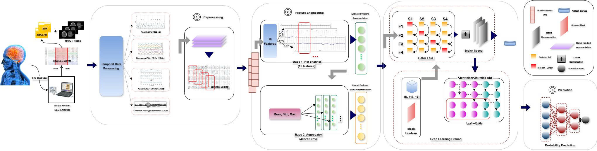

# A Unified Benchmarking Workspace for Window-Level Seizure Detection on OpenNeuro ds003029 ECoG

This repository packages a full research workspace for window-level seizure detection on intracranial EEG / ECoG from OpenNeuro `ds003029`. It is designed as a unified benchmark and reproducibility environment rather than as a single-model paper. The workspace standardizes preprocessing, window labeling, feature extraction, evaluation, reporting, and artifact storage across three modeling directions: timeseries forecasting, classical machine learning, and deep learning.

The current verified snapshot contains `21` completed experiments (`4` timeseries, `5` machine learning, `12` deep learning) with `0` verification errors and `0` warnings. On the present model-ready cohort, feature-engineered boosting is the strongest overall approach: `catboost` reaches ROC-AUC `0.8799` and average precision `0.8723`, outperforming the best tested deep model (`ce_tss_transformer`, ROC-AUC `0.8591`, AP `0.7752`) and the strongest residual-derived timeseries classifier (`sarimax_gamma`, ROC-AUC `0.8401`, AP `0.1804`).

This README is written for technical reviewers who need to understand what the workspace claims, how the comparison is structured, what the main findings are, and how to reproduce the results from the repository-local data and scripts.

## Overview

### Study Scope

The repository addresses a focused benchmarking question: under a shared preprocessing backbone and a common model-ready cohort, which modeling family provides the strongest practical seizure-detection performance?

The workspace is organized around three reviewer-facing research questions:

1. Under a unified pipeline, which family performs best on window-level seizure detection: timeseries, classical machine learning, or deep learning?
2. On a small subject-held-out ECoG cohort, do engineered aggregate features remain stronger than the tested deep models?
3. Can residual-derived SARIMA or SARIMAX provide a useful temporal baseline that is interpretable in the same reporting layer as ROC-AUC and PR-AUC?

### Main Contributions

- A single processing and reporting pipeline is used across timeseries, machine learning, and deep learning experiments.
- Leakage-safe leave-one-subject-out evaluation is implemented for machine learning and deep learning.
- A residual-to-classification bridge allows timeseries forecasting outputs to be summarized with discrimination metrics such as ROC-AUC and average precision.
- All major artifacts are stored repo-locally under `eda_outputs/`, allowing reviewers to inspect intermediate outputs, final summaries, and verification reports without reconstructing hidden steps.

### Study Positioning

The central contribution of this repository is pipeline unification and evidence-backed cross-family comparison. It should not be read as a claim that a novel neural architecture has been introduced. The deep-learning models included here are best understood as architecture-faithful research adapters evaluated under one common data and reporting framework.

## Workspace Architecture



The repository layout mirrors the research workflow.

| Path | Research role |
| --- | --- |
| `EEG/ds003029/` | Repo-local BIDS-format raw intracranial EEG / ECoG data |
| `src/` | Preprocessing code, feature extraction, split logic, dataset loaders, and model implementations or adapters |
| `tools/` | Command-line entrypoints for metadata refresh, data building, training, summarization, and verification |
| `configs/` | Experiment presets and report configuration files |
| `eda_outputs/` | Generated manifests, processed artifacts, trained-model outputs, and summary reports |
| `docs/` | Workflow notes, method details, runbooks, and report-preparation evidence |
| `notebooks/` | Exploratory analysis and QC notebooks |
| `tests/` | Smoke checks and regression checks for the workspace |

This structure is intentional: raw data, processing code, experiment presets, and output summaries are colocated so that reviewers can trace the path from source recordings to reported metrics.

## Data and Cohort

### Source Dataset

The upstream source is OpenNeuro `ds003029`, a BIDS-formatted intracranial EEG / ECoG dataset with BrainVision recordings, channel metadata, and event annotations. The experiments in this repository do not use every readable run in the full dataset. Instead, they use a curated model-ready subset selected through the repo's preprocessing and QC pipeline.

### Final Model-Ready Cohort

| Item | Value |
| --- | --- |
| Source dataset | `ds003029` |
| Modeling subjects | `8` |
| Modeling ictal runs | `16` |
| Total windows including boundary | `7646` |
| Boundary windows | `64` |
| Evaluable windows | `7582` |
| Ictal windows | `3102` |
| Interictal windows | `4480` |
| Positive rate | `40.91%` |
| Sampling rate after preprocessing | `256 Hz` |
| Window length | `2.0 s` |
| Step size | `0.5 s` |
| Boundary exclusion margin | `0.5 s` |

Window labels use a shared policy across the workspace:

- `1` = ictal
- `0` = interictal
- `-1` = boundary window

Subject heterogeneity is substantial. In the current subject-held-out setting, the number of positive windows in the held-out subject ranges from `33` to `889`. This matters when interpreting fold-to-fold variance in average precision, threshold stability, and F1.

### Family-Specific Data Views

All three modeling families consume different projections of the same curated cohort.

| Family | Primary artifact | Representation |
| --- | --- | --- |
| Timeseries | `eda_outputs/data_processing_v2/sarima/ds003029_sarima_v2_input.csv` | Chronological scalar series per run using exported `rms` values |
| Machine learning | `eda_outputs/data_processing_v2/folds/<fold_id>/{train,test}_dataset.npz` | Tabular `x_agg` feature matrices with `48` aggregate features per window |
| Deep learning | `eda_outputs/data_processing_v2/folds/` and `eda_outputs/data_processing_v2/raw_folds/` | Channel-feature tensors `x_channel` or raw-signal tensors `x_raw` |

The metadata and cohort manifests are refreshed into `eda_outputs/` and include:

- `ds003029_run_summary.csv`
- `ds003029_marker_qc_by_run.csv`
- `ds003029_seizure_intervals_by_run.csv`
- `ds003029_content_run_manifest.csv`
- `ds003029_model_ready_run_manifest.csv`

## Methods

### Shared Processing Backbone

The front half of the pipeline is shared across all three modeling directions.

1. Refresh BIDS metadata, run inventories, and seizure-interval summaries.
2. Preprocess each run to `256 Hz` with filtering, rereferencing, and bad-channel QC.
3. Slice deterministic `2.0 s` windows with a `0.5 s` stride.
4. Label windows with a midpoint rule and a `0.5 s` exclusion margin around seizure onsets and offsets.
5. Extract `16` per-channel descriptors and aggregate them into `48` tabular features for machine learning.
6. Export family-specific artifacts, train preset models, summarize metrics, and verify outputs.

The feature inventory includes time-domain and spectral descriptors such as `rms`, `line_length`, Hjorth activity or mobility or complexity, spectral band powers, spectral entropy, and peak frequency.

### Modeling Families and Evaluation Logic

| Family | Core method | Input view | Evaluation logic |
| --- | --- | --- | --- |
| Timeseries | SARIMA or SARIMAX forecasting with residual scoring | One scalar series per run plus optional exogenous covariates | Chronological train/test split within each run; residuals transformed into anomaly scores |
| Machine learning | Boosting, stacking, and SVM on engineered features | `x_agg` with `48` aggregate features | Leave-one-subject-out outer evaluation with subject-disjoint folds |
| Deep learning | Channel-feature or raw-signal neural architectures | `x_channel` or `x_raw` tensors | Same leave-one-subject-out fold structure used for machine learning |

This design supports a strong within-workspace comparison, but it also creates one key asymmetry: the timeseries track is not a native seizure classifier and does not use the same subject-held-out split policy as machine learning and deep learning.

### Reported Metrics

The reviewer-facing summary layer emphasizes:

- ROC-AUC
- Average precision
- F1 score
- Precision
- Sensitivity
- Specificity
- Accuracy

The timeseries family also reports forecast metrics such as RMSE and MAE. These forecast errors are useful for diagnosing the temporal model, but they are not directly comparable to classification metrics from machine learning and deep learning.

## Results

### Headline Results

The current verified snapshot yields the following family leaders.

| Family | Best model | Main metrics |
| --- | --- | --- |
| Timeseries forecast | `sarimax_hjorth` | RMSE mean `3.6159e-08`, MAE mean `2.5584e-08` |
| Timeseries residual classifier | `sarimax_gamma` | ROC-AUC `0.8401`, AP `0.1804`, F1 `0.1954` |
| Machine learning | `catboost` | ROC-AUC `0.8799`, AP `0.8723`, F1 `0.6531`, accuracy `0.7620` |
| Deep learning | `ce_tss_transformer` | ROC-AUC `0.8591`, AP `0.7752`, F1 `0.6218`, accuracy `0.7416` |

### Cross-Family Ranking

Top models by ROC-AUC from the current `eda_outputs/experiments/summary/cross_family_leaderboard.csv` snapshot are:

| Rank | Family | Model | ROC-AUC | Average precision | F1 |
| --- | --- | --- | ---: | ---: | ---: |
| 1 | Machine learning | `catboost` | `0.8799` | `0.8723` | `0.6531` |
| 2 | Deep learning | `ce_tss_transformer` | `0.8591` | `0.7752` | `0.6218` |
| 3 | Machine learning | `lightgbm_dart` | `0.8482` | `0.8137` | `0.6320` |
| 4 | Timeseries | `sarimax_gamma` | `0.8401` | `0.1804` | `0.1954` |
| 5 | Machine learning | `xgboost_optuna` | `0.8394` | `0.7702` | `0.6173` |

### Interpretation

Three conclusions are supported by the current outputs.

First, feature-engineered boosting is the strongest practical baseline on this cohort. `catboost` leads the workspace on both ROC-AUC and average precision, suggesting that carefully engineered aggregate descriptors remain highly competitive when data volume is modest and subject heterogeneity is high.

Second, deep learning is competitive but not dominant in the present setting. `ce_tss_transformer` is the best tested deep model and performs credibly, yet it still trails the top machine-learning baseline on both discrimination and precision-recall behavior.

Third, the timeseries branch is most useful as an interpretable temporal baseline rather than as the strongest detector. `sarimax_gamma` produces a reasonable ROC-AUC signal, but its average precision remains low, showing that residual-derived anomaly scoring is much weaker than the best native classifiers under class imbalance.

## Methodological Caveats and Limitations

The README should be read together with the following limitations.

- The cohort is relatively small after strict model-readiness filtering, with only `8` subjects and `16` ictal runs in the final benchmark.
- Subject heterogeneity is large, which likely contributes to fold-to-fold instability in average precision and thresholded metrics.
- Machine learning and deep learning use leakage-safe leave-one-subject-out evaluation, whereas timeseries uses chronological train/test splits within each run.
- Timeseries classification metrics are derived from residual scoring rather than from a native classifier.
- Several deep-learning implementations are architecture-faithful adapters rather than byte-for-byte reproductions of original upstream training code.

These caveats do not invalidate the benchmark, but they do define how its conclusions should be interpreted.

## Reproducibility

### Environment

The latest verified refresh was generated from conda environment `drug-tox-env` on Python `3.10.20`.

```bash
conda create -n drug-tox-env python=3.10 -y
conda activate drug-tox-env

# PyTorch is intentionally excluded from requirements.txt.
conda install pytorch pytorch-cuda -c pytorch -c nvidia
python -m pip install --upgrade pip
python -m pip install -r requirements.txt

# Optional GPU check
python -c "import torch; print(torch.cuda.is_available(), torch.version.cuda, torch.cuda.get_device_name(0) if torch.cuda.is_available() else 'cpu')"
```

If your shell resolves `python` incorrectly, use `python3` or the explicit conda interpreter.

### Recommended Staged Rerun

The staged workflow is the clearest path for reproducing the entire study.

```bash
export WORKSPACE_ROOT="$(pwd)"

python tools/workspace_content.py --workspace-root "$WORKSPACE_ROOT"

python tools/workspace_data.py timeseries --workspace-root "$WORKSPACE_ROOT"
python tools/workspace_data.py ml --workspace-root "$WORKSPACE_ROOT"
python tools/workspace_data.py dl --workspace-root "$WORKSPACE_ROOT"

python tools/workspace_experiment.py all --workspace-root "$WORKSPACE_ROOT" --force-retrain

python tools/workspace_reports.py summarize --family all --workspace-root "$WORKSPACE_ROOT"
python tools/workspace_reports.py cross_family_leaderboard --workspace-root "$WORKSPACE_ROOT"
python tools/workspace_reports.py verify --family all --workspace-root "$WORKSPACE_ROOT"
```

### Convenience Full-Pipeline Rerun

`tools/run_workspace_pipeline.py` remains available when a one-command bulk rerun is preferable.

```bash
python tools/run_workspace_pipeline.py --workspace-root "$WORKSPACE_ROOT"
```

### Key Output Files After a Successful Rerun

| Output | Path |
| --- | --- |
| Cross-family leaderboard | `eda_outputs/experiments/summary/cross_family_leaderboard.csv` |
| Machine-learning summary | `eda_outputs/experiments/summary/ml_metrics_summary.csv` |
| Deep-learning summary | `eda_outputs/experiments/summary/dl_metrics_summary.csv` |
| Timeseries summary | `eda_outputs/experiments/summary/timeseries_metrics_summary.csv` |
| Verification report | `eda_outputs/experiments/verification/verification_summary.md` |

## Repository Guide

The most relevant supporting documents for reviewers are:

- [docs/WORKFLOW.md](docs/WORKFLOW.md)
- [docs/EXPERIMENT_RUNBOOK.md](docs/EXPERIMENT_RUNBOOK.md)
- [docs/data_processing_v2.md](docs/data_processing_v2.md)
- [docs/MODELING_DATA_QUICK_REFERENCE.md](docs/MODELING_DATA_QUICK_REFERENCE.md)
- [docs/SARIMA_TRAINING.md](docs/SARIMA_TRAINING.md)
- [docs/FINAL_REPORT_PREPARATION_NOTES.md](docs/FINAL_REPORT_PREPARATION_NOTES.md)

Together, these documents provide the implementation detail behind the benchmark summary presented here.