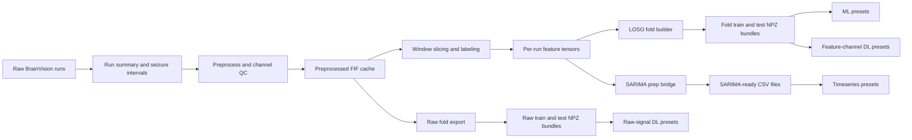

# Modeling Data Quick Reference

_Single-file reference for data split policy, preprocessing, feature schema, experiment inputs, and outputs across timeseries, ML, and DL._

---

## Purpose

This note is the fast lookup version of the deeper documents already in the repo:

- `docs/data_processing_v2.md`
- `docs/SARIMA_TRAINING.md`
- `docs/EXPERIMENT_RUNBOOK.md`

Use this file when you want one place to answer these questions quickly:

- How is the data split?
- What preprocessing is shared by all three directions?
- What are the exact inputs for timeseries, ML, and DL?
- Which files are produced by each direction?

## Shared policy

| Area | Current rule |
|---|---|
| Dataset | OpenNeuro `ds003029` ECoG/iEEG |
| Task | Binary seizure detection at the window level |
| Labels | `1=ictal`, `0=interictal`, `-1=boundary` |
| Target sampling rate | `256 Hz` after preprocessing |
| Window length | `2.0 s` |
| Window step | `0.5 s` |
| Boundary margin | `0.5 s` exclusion around onset and offset |
| Subject split | Leave-one-subject-out cross-validation |
| Normalization | Fit on train subjects only inside each fold |
| Channel policy | Keep surviving good channels, then pad to fold-global `max_channels` only when needed |

## Shared artifact flow



## Shared preprocessing outputs

All shared preprocessing artifacts live under:

`<workspace_root>/eda_outputs/data_processing_v2/`

Key outputs:

| File or folder | Meaning |
|---|---|
| `preprocess_run_summary.csv` | One row per run with preprocess status and basic QC fields |
| `bad_channels.csv` | Channel-level QC decisions |
| `preprocessed/*_preproc_raw.fif` | Canonical post-QC, resampled signal cache |
| `features/runs/*_window_tensor.npz` | Per-run feature tensors before fold assembly |
| `features/runs/*_window_index.csv` | Per-window timing and labels |
| `folds/<fold_id>/train_dataset.npz` | Fold-level training bundle for ML and feature-based DL |
| `folds/<fold_id>/test_dataset.npz` | Fold-level test bundle for ML and feature-based DL |
| `raw_folds/<fold_id>/raw_train_dataset.npz` | Fold-level raw training bundle for raw-signal DL |
| `raw_folds/<fold_id>/raw_test_dataset.npz` | Fold-level raw test bundle for raw-signal DL |
| `sarima/ds003029_sarima_v2_input.csv` | Combined SARIMA-ready CSV |

## Timeseries direction

### Input data

| Item | Value |
|---|---|
| Main input file | `eda_outputs/data_processing_v2/sarima/ds003029_sarima_v2_input.csv` |
| Training unit | One time window row from one run |
| Grouping key | `series_id` |
| Time coordinate | `t_mid_s` |
| Main target column | `rms` |
| Source feature | `agg_mean_rms` from v2 aggregate features |

### Input schema

Main columns used downstream:

- `series_id`
- `subject`
- `base`
- `window_id`
- `t_start_s`
- `t_stop_s`
- `t_mid_s`
- `rms`
- `y`
- `source_feature`

### Split behavior

- Chronological train/test split happens inside each run.
- Boundary windows are retained so temporal cadence is not broken.
- No LOSO fold tensors are used directly by SARIMA.

### Main outputs

Timeseries experiment outputs live under:

`<workspace_root>/eda_outputs/experiments/timeseries/<experiment_name>/`

Typical files:

- `series_metrics.csv`
- `predictions/*.csv`
- `reports/*`
- `checkpoints/*`

## Machine learning direction

### Input data

| Item | Value |
|---|---|
| Main input files | `folds/<fold_id>/train_dataset.npz` and `folds/<fold_id>/test_dataset.npz` |
| Main feature matrix | `x_agg` |
| Shape | `(N, 48)` |
| Labels | `y` with only `{0, 1}` |
| Split key | LOSO fold id |

### Feature meaning

`x_agg` contains `48` dimensions built from `16` per-channel features with three reducers:

- `agg_mean_*`
- `agg_std_*`
- `agg_max_*`

This is the direct tabular input for models such as XGBoost, LightGBM, CatBoost, SVM, and stacking ensembles.

### Split behavior

- Train and test subjects are disjoint by construction.
- Boundary windows are dropped before fold export.
- Scaling is fit on train windows only, then applied to test windows.

### Main outputs

ML experiment outputs live under:

`<workspace_root>/eda_outputs/experiments/ml/<experiment_name>/`

Typical files:

- `aggregate_metrics.csv`
- `fold_metrics.csv`
- `all_predictions.csv`
- `checkpoints/*.joblib`
- `predictions/*.csv`
- `reports/*`

## Deep learning direction

### Feature-channel DL

| Item | Value |
|---|---|
| Main input files | `folds/<fold_id>/train_dataset.npz` and `folds/<fold_id>/test_dataset.npz` |
| Main tensor | `x_channel` |
| Shape | `(N, global_max_channels, 16)` |
| Padding mask | `x_channel_mask` with shape `(N, global_max_channels)` |
| Optional extra branch | `x_agg` with shape `(N, 48)` |

This path is used by channel-feature DL models such as:

- `inresformer`
- `gat_bilstm`
- `ce_tss_transformer`
- `dbconformer`
- `graphs4mer`
- `dcrnn`

### Raw-signal DL

| Item | Value |
|---|---|
| Main input files | `raw_folds/<fold_id>/raw_train_dataset.npz` and `raw_folds/<fold_id>/raw_test_dataset.npz` |
| Main tensor | `x_raw` |
| Typical shape | `(N, max_channels, n_samples)` |
| Raw mask | `x_raw_mask` |
| Labels | `y` |

This path is used by raw-signal DL models such as:

- `eegnet`
- `eegwavenet`
- `cnn_bilstm`
- `bendr`
- `reve`
- `biseizurere_proxy`

### Split behavior

- DL reuses the same LOSO fold separation as ML.
- Feature-channel DL reads fold NPZ bundles.
- Raw-signal DL reads raw fold NPZ bundles exported from cached FIF files.

### Main outputs

DL experiment outputs live under:

`<workspace_root>/eda_outputs/experiments/dl/<experiment_name>/`

Typical files:

- `aggregate_metrics.csv`
- `fold_metrics.csv`
- `all_predictions.csv`
- `checkpoints/*.pt`
- `predictions/*.csv`
- `reports/*`

## Metric inspection helper

The repo now includes a summary script for all three directions:

`tools/summarize_experiment_metrics.py`

Example run:

```bash
conda run -n drug-tox-env python tools/summarize_experiment_metrics.py --workspace-root /path/to/workspace
```

Generated outputs:

- `eda_outputs/experiments/summary/ml_metrics_summary.csv`
- `eda_outputs/experiments/summary/dl_metrics_summary.csv`
- `eda_outputs/experiments/summary/timeseries_metrics_summary.csv`
- `eda_outputs/experiments/summary/all_metrics_long.csv`
- `eda_outputs/experiments/summary/metrics_summary.md`

## Related docs

Use these when you need deeper detail instead of the quick reference:

- `docs/data_processing_v2.md` for the full v2 artifact pipeline
- `docs/SARIMA_TRAINING.md` for SARIMA-specific trainer expectations
- `docs/EXPERIMENT_RUNBOOK.md` for command-line runs across timeseries, ML, and DL
- `docs/MODEL_IMPLEMENTATION_NOTES.md` for model-specific implementation fidelity notes