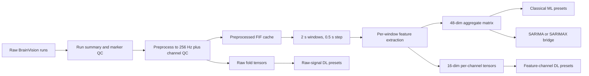

# Bao cao 4 section cho workspace Seizure Detection using ECoG

_Cap nhat theo workspace hien tai sau khi dua `eda_outputs/` vao trong repo root._

## TL;DR

- Workspace hien tai da tu chua duoc: du lieu `EEG/ds003029/`, artifacts `eda_outputs/`, scripts, va report wrappers deu co the chay truc tiep tu repo root.
- Ve bai toan seizure detection tren subset modeling-ready hien tai, huong ML dang manh nhat; `catboost` la moc tham chieu tot nhat trong workspace nay.
- DL da co mot so model canh tranh duoc, nhung ket qua van phu thuoc rat manh vao quy mo subset, mat can bang nhan, va muc do faithful cua tung adapter implementation.
- SARIMA/SARIMAX nen duoc trinh bay nhu mot baseline forecasting/anomaly theo chuoi thoi gian, khong nen so sanh truc tiep voi ROC-AUC/F1 cua bai toan phan loai seizure windows.

## Section 2. Du lieu, EDA, va muc do san sang cho modeling

### 2.1. Nguon du lieu va pham vi workspace hien tai

Theo [DATASET_OVERVIEW_vi.md](DATASET_OVERVIEW_vi.md), nguon goc la OpenNeuro `ds003029`, mot tap iEEG/ECoG theo chuan BIDS voi BrainVision signal files (`.vhdr`, `.vmrk`, `.eeg`), `channels.tsv`, `events.tsv`, va metadata cap subject/session/run. Tai lieu overview mo ta ban full dataset lon hon workspace hien tai. Trong workspace nay can tach ro hai lop pham vi:

| Pham vi | Gia tri | Nguon bang chung | Y nghia |
|---|---:|---|---|
| Full dataset tham chieu | 35 participants, ~10.32 GB | [DATASET_OVERVIEW_vi.md](DATASET_OVERVIEW_vi.md) | Boi canh khoa hoc cua bo ds003029 day du |
| Event inventory trong workspace | 106 runs co `events.tsv` doc duoc | [ds003029_marker_qc_by_run.csv](../eda_outputs/ds003029_marker_qc_by_run.csv) | Lop metadata de kiem tra marker va seizure intervals |
| Modeling-ready subset hien tai | 16 runs, 8 subjects | [ds003029_model_ready_run_manifest.csv](../eda_outputs/ds003029_model_ready_run_manifest.csv) | Tap du lieu thuc su dang duoc dua vao preprocessing, folds, va experiments |

Noi cach khac, workspace khong dang huan luyen tren toan bo ds003029, ma tren mot subset da duoc curated de dam bao co du `.eeg`, marker kha dung, va artifact processing on dinh.

### 2.2. Do tin cay cua marker va seizure intervals

Hai tang bang chung quan trong cho readiness la metadata summary va marker QC:

- [ds003029_run_summary.csv](../eda_outputs/ds003029_run_summary.csv)
- [ds003029_marker_qc_by_run.csv](../eda_outputs/ds003029_marker_qc_by_run.csv)
- [ds003029_seizure_intervals_by_run.csv](../eda_outputs/ds003029_seizure_intervals_by_run.csv)

Validation runtime tren workspace hien tai cho thay:

- `106` runs co `events.tsv` va deu doc duoc.
- `103` runs co onset comparable; `103/103` khop voi summary trong nguong `0.5 s`.
- `78` runs co offset comparable; `78/78` khop voi summary trong nguong `0.5 s`.
- Van ton tai `16` multi-seizure candidates, `34` runs co unpaired onset, va `1` run co orphan offset.

Ket luan EDA quan trong o day la: marker layer du tin cay de tao seizure intervals cho mot tap curated, nhung khong phai moi run trong kho metadata deu sach de dua thang vao modeling. Day la ly do subset modeling-ready hien tai chi giu `16` runs.

### 2.3. Windowing, nhan, va mat can bang lop

Theo [data_processing_v2.md](data_processing_v2.md) va [MODELING_DATA_QUICK_REFERENCE.md](MODELING_DATA_QUICK_REFERENCE.md), quy uoc chung hien tai la:

- sample rate sau preprocess: `256 Hz`
- do dai window: `2.0 s`
- buoc truot: `0.5 s`
- boundary margin: `0.5 s`
- nhan: `1=ictal`, `0=interictal`, `-1=boundary`

Thong ke thuc te tu [label_distribution.csv](../eda_outputs/data_processing_v2/reports/label_distribution.csv):

| Subject | Runs | Windows | Ictal | Interictal | Dropped margin |
|---|---:|---:|---:|---:|---:|
| jh101 | 3 | 1235 | 496 | 727 | 12 |
| jh102 | 2 | 1350 | 889 | 453 | 8 |
| jh103 | 2 | 870 | 504 | 358 | 8 |
| pt01 | 2 | 1242 | 344 | 890 | 8 |
| pt13 | 2 | 576 | 33 | 535 | 8 |
| pt3 | 1 | 573 | 232 | 337 | 4 |
| pt7 | 2 | 1010 | 185 | 817 | 8 |
| ummc001 | 2 | 790 | 419 | 363 | 8 |

Tong hop toan subset:

- Tong windows: `7646`
- Ictal: `3102`
- Interictal: `4480`
- Dropped margin: `64` windows, tuong duong khoang `0.84%`

Y nghia modeling:

- Mat can bang lop ton tai o muc vua phai tren toan bo subset, nhung rat lech theo tung subject.
- `pt13` la vi du lech manh: chi `33` ictal so voi `535` interictal.
- Vi vay, cac chi so tong hop theo fold va theo subject quan trong hon viec nhin accuracy thuan tuy.

### 2.4. EDA tren feature va seasonality

Bang [class_separability.csv](../eda_outputs/data_processing_v2/reports/class_separability.csv) cho thay subset nay thuc su co tin hieu tach lop o nhom feature aggregate. Cac feature manh nhat hien tai la:

| Feature | AUC |
|---|---:|
| `agg_max_beta_power` | 0.8285 |
| `agg_std_beta_power` | 0.8216 |
| `agg_max_line_length` | 0.8049 |
| `agg_mean_beta_power` | 0.7997 |
| `agg_std_line_length` | 0.7953 |

Dieu nay khop voi truc giang giai thich sinh ly tin hieu: seizure windows trong subset nay khac biet ro hon o beta-band activity, line length, va mot phan gamma low.

Ve khia canh time-series EDA, [eda_trends_seasonality_issues_ds003029_review.md](../archive/legacy_docs/eda_trends_seasonality_issues_ds003029_review.md) khong ung ho mot seasonality manh, on dinh, va co y nghia giong bai toan du bao chu ky. Vi vay:

- SARIMA/SARIMAX co gia tri nhu baseline forecasting/anomaly theo tung run.
- Khong nen dong nhat phan tich ACF/PACF/seasonality voi bang chung rang time-series se vuot ML/DL trong bai toan seizure detection.

## Section 3. Phuong phap, pipeline, va implementation hien co

### 3.1. Shared preprocessing va artifact flow

Pipeline chung cho ba huong timeseries, ML, va DL duoc mo ta trong [data_processing_v2.md](data_processing_v2.md), [MODELING_DATA_QUICK_REFERENCE.md](MODELING_DATA_QUICK_REFERENCE.md), va [WORKFLOW.md](WORKFLOW.md).

Nhung quy uoc quan trong nhat:

- resample ve `256 Hz`
- bandpass `0.5-120 Hz`
- notch harmonics
- average reference
- bad-channel QC truoc khi sinh window va features

### 3.2. Feature engineering

Code feature nam o:

- [time_domain.py](../src/ds003029_eda/features/time_domain.py)
- [freq_domain.py](../src/ds003029_eda/features/freq_domain.py)
- [windowing.py](../src/ds003029_eda/features/windowing.py)

Bo feature per-channel hien tai gom `16` thanh phan:

- Time-domain: `rms`, `line_length`, `hjorth_activity`, `hjorth_mobility`, `hjorth_complexity`, `zero_crossing_rate`, `kurtosis`, `skewness`
- Frequency-domain: `delta_power`, `theta_power`, `alpha_power`, `beta_power`, `gamma_low_power`, `gamma_high_power`, `spectral_entropy`, `peak_frequency`

Tu do pipeline tao ra hai dang dau vao chinh:

- `x_agg` kich thuoc `(N, 48)`, duoc tao bang ba phep gop `mean/std/max` tren `16` feature per-channel
- `x_channel` kich thuoc `(N, max_channels, 16)` kem `x_channel_mask`

Dieu nay giai thich vi sao ML tren workspace nay co the rat manh: feature engineering da nen thong tin seizure vao mot vector nho, on dinh, va phu hop voi du lieu khong qua lon.

### 3.3. Chinh sach split va validation

Can tach ro hai tang split:

| Huong | Split chinh | Chi tiet |
|---|---|---|
| ML | LOSO theo subject | train/test disjoint theo subject, su dung fold artifacts |
| DL | LOSO theo subject | tai su dung cung fold separation voi ML |
| Timeseries | Chronological split trong tung run | giu cadence thoi gian, khong dung truc tiep LOSO fold tensors |

Trong [ml.py](../src/ds003029_eda/experiments/ml.py), outer evaluation chay tren cac folds subject-disjoint. O inner tuning, `_build_group_cv()` uu tien `StratifiedGroupKFold`, va groups duoc truyen bang `train_index["base"]` khi co san. Nghia la:

- outer test la leave-one-subject-out
- inner CV co gang giu group theo run/base, khong chi random window split
- nhung day van khong phai temporal CV theo nghia chuoi thoi gian

Day la diem nen noi ro khi thuyet trinh, tranh goi nham ML path la "time-series split".

### 3.4. Cac nhom model trong repo

Bang map implementation nam o [MODEL_IMPLEMENTATION_NOTES.md](../MODEL_IMPLEMENTATION_NOTES.md):

- Timeseries: `sarima_rms`, `sarimax_gamma`, `sarimax_hjorth`, `sarimax_rms_std`
- ML: `catboost`, `lightgbm_dart`, `xgboost_optuna`, `stacking`, `svm_rbf_rfe`
- DL feature-channel: `inresformer`, `gat_bilstm`, `ce_tss_transformer`, `dbconformer`, `graphs4mer`, `dcrnn`
- DL raw-signal: `eegnet`, `eegwavenet`, `cnn_bilstm`, `bendr`, `reve`, `biseizurere_proxy`

Danh gia fidelity can noi thang trong report:

- ML va SARIMA/SARIMAX la library-backed implementations, co do faithful cao.
- Phan lon DL la architecture-faithful adapters cho tensor format cua repo, khong phai byte-for-byte port tu upstream training pipelines.
- `biseizurere_proxy` la surrogate adapter vi khong co public canonical implementation de mirror trung thuc.

## Section 4. Ket qua thuc nghiem va cach dien giai

### 4.1. Tinh trang output hien tai

Workspace da co day du output cho `21` experiments, da duoc verify sach trong [verification_summary.md](../eda_outputs/experiments/verification/verification_summary.md):

- `4` timeseries presets
- `5` ML presets
- `12` DL presets
- `0` errors
- `0` warnings

Tong hop metric va plots co san tai:

- [metrics_summary.md](../eda_outputs/experiments/summary/metrics_summary.md)
- [ml_metrics_overview.png](../eda_outputs/experiments/summary/plots/ml_metrics_overview.png)
- [dl_metrics_overview.png](../eda_outputs/experiments/summary/plots/dl_metrics_overview.png)
- [timeseries_metrics_overview.png](../eda_outputs/experiments/summary/plots/timeseries_metrics_overview.png)

### 4.2. Mo hinh dan dau theo tung huong

| Huong | Mo hinh dan dau | Metric chinh |
|---|---|---|
| ML | `catboost` | ROC-AUC `0.8799`, AP `0.8723`, F1 `0.6531`, precision `0.7308`, sensitivity `0.7248`, specificity `0.8315`, accuracy `0.7620` |
| DL | `ce_tss_transformer` | ROC-AUC `0.8591`, AP `0.7752`, F1 `0.6218`, precision `0.6534`, sensitivity `0.6976`, specificity `0.7957`, accuracy `0.7416` |
| Timeseries | `sarimax_hjorth` | RMSE mean `3.6159e-08` |
| Timeseries | `sarimax_rms_std` | sMAPE mean `34.5963` |

> Luu y quan trong: RMSE, sMAPE, va R2 cua SARIMA/SARIMAX la metric forecasting/regression tren scalar signal theo thoi gian. Chung khong the duoc so sanh truc tiep voi ROC-AUC, AP, hay F1 cua bai toan phan loai seizure windows.

### 4.3. Cach doc ket qua hop ly

Nhan dinh chinh nen dua vao presentation:

1. Trên subset hien tai, feature-based ML dang la baseline manh nhat. `catboost` vuot `ce_tss_transformer` o ca ROC-AUC, AP, va F1.
2. DL khong that bai toan dien. `ce_tss_transformer`, `inresformer`, va `dbconformer` van dat muc canh tranh, cho thay channel-feature tensors co gia tri.
3. Nhieu raw-signal adapters yeu ro ret. `bendr` (`0.5686` ROC-AUC), `biseizurere_proxy` (`0.5125`), va `reve` (`0.4884`) cho thay du lieu hien tai chua du de tat ca raw architectures phat huy.
4. Timeseries cho vai tro bo tro hon la headline classification. Mot so model co RMSE rat nho do scale cua target `rms`, nhung `r2_test_mean` am cho thay forecasting tren held-out windows van kho.

### 4.4. Giai thich vi sao ML hien dang thang

Ket qua nay hop ly ve mat ky thuat:

- So luong subject hien chi la `8`, rat nho so voi muc can thiet de raw DL on dinh.
- Feature engineering da co huong tin hieu ro, dac biet o beta power va line length.
- LOSO theo subject lam bai toan tong quat hoa kho hon random split, nen model nao tot tren LOSO co gia tri thuc te hon.
- DL raw-signal trong repo chu yeu la adapters, khong duoc huong loi tu upstream pretraining day du.

Neu muc tieu la bao cao trung thuc, nen trinh bay ML la ket qua manh nhat hien co, DL la huong co tiem nang nhung chua vuot duoc ML tren workspace nay.

## Section 5. Ket luan, han che, va kien nghi tiep theo

### 5.1. Ket luan co the dua vao report

Workspace hien tai da du de tra loi mot cach co bang chung cho 4 y lon cua report:

- Du lieu co marker layer va preprocessing layer du tin cay de tao subset modeling-ready.
- Pipeline da tach ro giua metadata, preprocessing, feature extraction, folds, experiments, summary, va verification.
- Tren subset hien tai, `catboost` la ket qua tot nhat cho bai toan seizure detection window-level.
- `ce_tss_transformer` la DL ung vien manh nhat, nhung chua vuot ML.
- SARIMA/SARIMAX phu hop de bo sung goc nhin forecasting/anomaly, khong phai de thay the bai toan classification.

### 5.2. Han che can noi thang

1. Tap huan luyen hien tai chi gom `16` runs tu `8` subjects, nho hon rat nhieu so voi bo ds003029 day du.
2. Marker inventory rong hon tap modeling-ready, va van con nhieu run co unpaired onset hoac multi-seizure complexity.
3. Mat can bang lop thay doi rat manh theo subject.
4. Nhieu DL models la repo adapters; fidelity voi upstream training recipe khong dong deu.
5. Timeseries metrics va classification metrics phuc vu hai muc tieu khac nhau.

### 5.3. Kien nghi trinh bay va huong phat trien

De xay dung report/presentation thuyet phuc, nen di theo truc sau:

1. Dung `catboost` lam benchmark chinh cho seizure detection tren workspace hien tai.
2. Dung `ce_tss_transformer` lam DL doi trong canh tranh, de cho thay DL co tiem nang khi du lieu va implementation du manh.
3. Dung SARIMAX nhu baseline bo tro cho goc nhin forecasting, anomaly, va run-level temporal behavior.
4. Mo rong curated subset vuot qua `16` runs truoc khi dua ra ket luan manh hon ve raw-signal DL.
5. Them calibration, threshold tuning, va confidence intervals theo subject/fold cho cac model dan dau.

### 5.4. Trang thai workspace sau khi da chuan hoa duong dan

Sau khi dua `eda_outputs/` vao repo root, cac diem van hanh quan trong da duoc xac nhan lai:

- `tools/analyze_event_markers_ds003029.py` da chay duoc voi repo-local `--workspace-root` va ghi output vao [eda_outputs](../eda_outputs/).
- `tools/validate_labels_ds003029.py` da resolve dung `events.tsv` va `run_summary` trong layout moi.
- `tools/workspace_reports.py verify --family all` tra ve `0` errors va `0` warnings trong workspace root moi.

Ket luan operational la repo nay hien da self-contained hon truoc: nguoi dung co the lam viec tu repo root ma khong can tro ra mot outer workspace rieng de tim `eda_outputs/`.

## Tai lieu bang chung da su dung

- [DATASET_OVERVIEW_vi.md](DATASET_OVERVIEW_vi.md)
- [data_processing_v2.md](data_processing_v2.md)
- [MODELING_DATA_QUICK_REFERENCE.md](MODELING_DATA_QUICK_REFERENCE.md)
- [WORKFLOW.md](WORKFLOW.md)
- [EXPERIMENT_RUNBOOK.md](EXPERIMENT_RUNBOOK.md)
- [MODEL_IMPLEMENTATION_NOTES.md](../MODEL_IMPLEMENTATION_NOTES.md)
- [ml.py](../src/ds003029_eda/experiments/ml.py)
- [time_domain.py](../src/ds003029_eda/features/time_domain.py)
- [freq_domain.py](../src/ds003029_eda/features/freq_domain.py)
- [windowing.py](../src/ds003029_eda/features/windowing.py)
- [label_distribution.csv](../eda_outputs/data_processing_v2/reports/label_distribution.csv)
- [class_separability.csv](../eda_outputs/data_processing_v2/reports/class_separability.csv)
- [ds003029_model_ready_run_manifest.csv](../eda_outputs/ds003029_model_ready_run_manifest.csv)
- [ds003029_marker_qc_by_run.csv](../eda_outputs/ds003029_marker_qc_by_run.csv)
- [metrics_summary.md](../eda_outputs/experiments/summary/metrics_summary.md)
- [verification_summary.md](../eda_outputs/experiments/verification/verification_summary.md)
- [eda_trends_seasonality_issues_ds003029_review.md](../archive/legacy_docs/eda_trends_seasonality_issues_ds003029_review.md)
