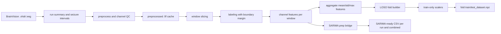

# Data Processing v2 - ds003029 Seizure Detection

## 1. Scope

This document describes the current v2 preprocessing and feature pipeline for OpenNeuro `ds003029`, plus how the produced artifacts map to the three modeling directions used in this repo:

1. Timeseries / SARIMA
2. Classical machine learning
3. Deep learning

The v2 pipeline is window-level seizure detection with these core decisions:

- Task: binary ictal vs interictal detection at the window level.
- Label states: `1=ictal`, `0=interictal`, `-1=boundary window`.
- Target sampling rate after preprocessing: `256 Hz`.
- Windowing: `2.0 s` window with `0.5 s` step.
- Boundary policy: midpoint labeling with `0.5 s` exclusion margin around onset and offset.
- Split policy: leave-one-subject-out cross-validation.
- Normalization: fit on train subjects only for each fold.
- Channel policy: keep every surviving good channel, then pad to fold-global `max_channels` only when building fold tensors.

## 2. End-to-end flow



## 3. Code map

- `src/ds003029_eda/data/io.py`: run discovery, BrainVision loading, channel selection.
- `src/ds003029_eda/data/channel_qc.py`: flat, variance, and line-noise bad-channel detection.
- `src/ds003029_eda/data/preprocess.py`: notch, bandpass, resample, reference, centered output validation.
- `src/ds003029_eda/data/normalize.py`: train-only scalers for aggregate and channel tensors.
- `src/ds003029_eda/features/windowing.py`: deterministic sliding windows.
- `src/ds003029_eda/features/time_domain.py`: time-domain channel features.
- `src/ds003029_eda/features/freq_domain.py`: spectral channel features.
- `src/ds003029_eda/labels/labeler.py`: midpoint-based seizure labels with boundary exclusion.
- `src/ds003029_eda/splits/patient_cv.py`: LOSO subject splits and leakage checks.
- `src/ds003029_eda/pipelines/run_preprocess.py`: preprocessing cache and QC artifacts.
- `src/ds003029_eda/pipelines/run_features.py`: run tensors, fold datasets, reports.
- `src/ds003029_eda/pipelines/run_sarima_prep.py`: v2-to-SARIMA bridge that exports `agg_mean_rms` as a univariate run time series.
- `src/ds003029_eda/datasets/fold_dataset.py`: DataLoader-friendly wrapper for fold `.npz` bundles.
- `src/ds003029_eda/utils/class_balance.py`: helper for balanced binary class weights.
- `tools/run_data_processing_v2.py`: CLI for preprocess, features, full, and `sarima-prep`.
- `tools/train_sarima.py`: SARIMA trainer that consumes a CSV with `series_id`, `t_mid_s`, and `rms`.

## 4. Default configuration

| Area | Parameter | Default | Meaning |
|---|---|---:|---|
| Preprocess | `target_sfreq` | `256.0` | Final sampling rate after resampling |
| Preprocess | `bandpass_low` | `0.5` | High-pass cutoff in Hz |
| Preprocess | `bandpass_high` | `120.0` | Low-pass cutoff in Hz |
| Preprocess | `notch_harmonics` | `3` | Notch at `50`, `100`, `150` Hz |
| Preprocess | `reference_mode` | `average` | Common average reference when at least two good channels remain |
| Features | `window_sec` | `2.0` | Window duration in seconds |
| Features | `step_sec` | `0.5` | Window stride in seconds |
| Features | `label_margin_sec` | `0.5` | Boundary exclusion margin |
| Features | `fill_missing_after_scaling` | `0.0` | Fill value after scaler transform |
| SARIMA bridge | `aggregate_feature_name` | `agg_mean_rms` | Aggregate feature exported as SARIMA target `rms` |

## 5. Artifact layout

All v2 artifacts are written under:

`<workspace_root>/eda_outputs/data_processing_v2/`

### 5.1 Preprocess artifacts

- `preprocess_run_summary.csv`: one row per run with `preprocess_ok`, `sfreq_out`, `n_channels_good`, and error info.
- `bad_channels.csv`: channel-level QC flags and final bad-channel decisions.
- `preprocessed/*_preproc_raw.fif`: cached preprocessed signals used as the canonical post-QC signal source.
- `reports/qc_report.html`: QC summary view.

### 5.2 Run-level feature artifacts

- `features/runs/*_window_tensor.npz`
  - `x_channel`: shape `(N_windows, C_run, 16)`
  - `x_agg`: shape `(N_windows, 48)`
  - `y`: shape `(N_windows,)`, includes `-1` boundary windows at the run level
  - `channel_feature_names`
  - `aggregate_feature_names`
- `features/runs/*_window_index.csv`
  - `base`, `subject`, `window_id`, `t_start_s`, `t_stop_s`, `t_mid_s`, `y`
- `run_feature_inventory.csv`: one row per run with `tensor_path`, `index_path`, label counts, and `feature_ok`.

### 5.3 Fold artifacts for ML and DL

- `folds/<fold_id>/train_dataset.npz`
- `folds/<fold_id>/test_dataset.npz`
- `folds/<fold_id>/train_index.csv`
- `folds/<fold_id>/test_index.csv`
- `folds/<fold_id>/scalers.json`
- `fold_manifest.json`

Each fold dataset bundle contains:

- `x_agg`: shape `(N, 48)`
- `x_channel`: shape `(N, global_max_channels, 16)`
- `x_channel_mask`: shape `(N, global_max_channels)`
- `y`: shape `(N,)`, only `0` and `1` because boundary windows are dropped before fold export

### 5.4 SARIMA bridge artifacts

The SARIMA bridge writes under:

`<workspace_root>/eda_outputs/data_processing_v2/sarima/`

- `ds003029_sarima_v2_input.csv`: combined multirun CSV for `tools/train_sarima.py`
- `runs/*_sarima_input.csv`: one run per CSV
- `sarima_prep_manifest.json`: summary of exported series and counts

Each SARIMA CSV contains:

- `series_id`: run identifier used by the trainer
- `subject`
- `base`
- `window_id`
- `t_start_s`
- `t_stop_s`
- `t_mid_s`
- `rms`: exported from `agg_mean_rms`
- `y`: retained for later analysis, including `-1` boundary windows
- `source_feature`: currently `agg_mean_rms`

## 6. The three modeling directions

## 6.1 Timeseries / SARIMA

### Data used

- Primary file: `eda_outputs/data_processing_v2/sarima/ds003029_sarima_v2_input.csv`
- Optional per-run files: `eda_outputs/data_processing_v2/sarima/runs/*_sarima_input.csv`
- One row equals one time window from one run.
- One modeled scalar per row: `rms`, which is the v2 aggregate feature `agg_mean_rms`.

### Why this format

SARIMA needs a single regularly ordered numeric series per run. The bridge therefore:

- reads v2 `x_agg`
- picks `agg_mean_rms`
- sorts by `t_mid_s`
- keeps one `series_id` per run
- keeps boundary windows so the time cadence is not broken

### Current workspace status

Validated on the current workspace:

- `16` series exported
- `7646` total rows exported
- output root: `eda_outputs/data_processing_v2/sarima/`

### Train command

```powershell
python tools/train_sarima.py --features data_processing_v2/sarima/ds003029_sarima_v2_input.csv --output-subdir sarima_v2_from_data_processing_v2
```

## 6.2 Classical machine learning

### Data used

- Primary files: `folds/<fold_id>/train_dataset.npz` and `folds/<fold_id>/test_dataset.npz`
- Core feature matrix: `x_agg` with shape `(N, 48)`
- Labels: `y` with binary values `{0, 1}`
- Scalers: `scalers.json`

### What `x_agg` means

The `48` dimensions are built from `16` per-channel features and three cross-channel reducers:

- `agg_mean_*`
- `agg_std_*`
- `agg_max_*`

This is the most direct input for logistic regression, SVM, random forest, XGBoost, LightGBM, and similar tabular learners.

### Label policy

- Boundary windows are excluded before fold export.
- Fold datasets are leakage-safe because train and test subjects are disjoint.
- Normalization is fit on train windows only.

### Current workspace status

Validated previously in this workspace:

- `8` LOSO folds built
- no subject overlap violations
- all folds contain both ictal and interictal windows

## 6.3 Deep learning

### Data used for feature-based DL

- Primary files: `folds/<fold_id>/train_dataset.npz` and `folds/<fold_id>/test_dataset.npz`
- Feature tensor: `x_channel` with shape `(N, global_max_channels, 16)`
- Padding mask: `x_channel_mask` with shape `(N, global_max_channels)`
- Optional aggregate branch: `x_agg` with shape `(N, 48)`
- Labels: `y`

This format is suitable for:

- channel-feature CNNs
- Transformers over channels
- hybrid models that combine `x_channel` and `x_agg`

### Data used for raw-signal DL

- Starting point: `preprocessed/*_preproc_raw.fif`
- These files contain the post-QC, resampled, referenced signal at `256 Hz`
- A dedicated raw-window extractor is still a separate step if you want tensors like `(N, C, T)` for EEGNet or temporal CNN models

### Helper utilities added for DL

- `ds003029_eda.datasets.FoldDataset`: loads a fold `.npz` and returns tensors in `agg`, `channel`, or `both` mode
- `ds003029_eda.utils.compute_class_weights`: computes balanced class weights from `y`, ignoring `-1`

### Current workspace smoke check

Validated on `fold_02_jh102/train_dataset.npz`:

- dataset length: `6240`
- sample shapes in `both` mode: `(48,)`, `(117, 16)`, `(117,)`
- example class weights: `{0: 0.7747703004718153, 1: 1.4098508811568007}`

## 7. Consumption examples

### 7.1 Build preprocess and fold artifacts

```powershell
python tools/run_data_processing_v2.py preprocess --workspace-root /path/to/Seizure-Dectection-using-ECoG- --artifact-subdir data_processing_v2 --overwrite
python tools/run_data_processing_v2.py features --workspace-root /path/to/Seizure-Dectection-using-ECoG- --artifact-subdir data_processing_v2 --overwrite
```

### 7.2 Export SARIMA-ready CSV from v2 outputs

```powershell
python tools/run_data_processing_v2.py sarima-prep --workspace-root /path/to/Seizure-Dectection-using-ECoG- --artifact-subdir data_processing_v2 --overwrite
```

### 7.3 Classical ML example

```python
import json
import numpy as np

train = np.load("eda_outputs/data_processing_v2/folds/fold_01_jh101/train_dataset.npz", allow_pickle=False)
test = np.load("eda_outputs/data_processing_v2/folds/fold_01_jh101/test_dataset.npz", allow_pickle=False)

X_train = train["x_agg"]
y_train = train["y"]
X_test = test["x_agg"]
y_test = test["y"]

with open("eda_outputs/data_processing_v2/folds/fold_01_jh101/scalers.json", "r", encoding="utf-8") as fh:
    scalers = json.load(fh)
```

### 7.4 Deep learning example

```python
from torch.utils.data import DataLoader

from ds003029_eda.datasets import FoldDataset
from ds003029_eda.utils import compute_class_weights

dataset = FoldDataset(
    "eda_outputs/data_processing_v2/folds/fold_02_jh102/train_dataset.npz",
    mode="both",
)
weights = compute_class_weights(dataset.y.cpu().numpy())
loader = DataLoader(dataset, batch_size=32, shuffle=True)
```

### 7.5 SARIMA example

```python
from ds003029_eda.paths import get_paths
from ds003029_eda.sarima_training import run_sarima_training

prepared, metrics_df = run_sarima_training(
    feature_path="data_processing_v2/sarima/ds003029_sarima_v2_input.csv",
    output_subdir="sarima_v2_from_data_processing_v2",
    paths=get_paths("/path/to/Seizure-Dectection-using-ECoG-"),
)
```

## 8. Readiness summary

| Direction | Main artifact | Ready now | Remaining gap |
|---|---|---|---|
| Timeseries / SARIMA | `sarima/ds003029_sarima_v2_input.csv` | Yes | Optional future work: try other univariate targets besides `agg_mean_rms` |
| Classical ML | `folds/*/train_dataset.npz` with `x_agg` | Yes | Model selection and thresholding are still downstream tasks |
| Deep learning on features | `folds/*/train_dataset.npz` with `x_channel` and mask | Yes | Training architecture is still downstream |
| Deep learning on raw signal | `preprocessed/*_preproc_raw.fif` | Partially | Needs explicit raw window tensor extraction |

## 9. Known limits and deferred decisions

- `class_separability.csv` is computed on `x_agg`, not on the full channel tensor.
- SARIMA currently uses only one scalar target, `agg_mean_rms`, even though other aggregate features exist.
- Raw-signal DL is not blocked by preprocessing, but it still needs a dedicated `(N, C, T)` extractor.
- Fold tensors are padded to the fold-global `max_channels`, so channel count is not fixed globally across every experiment unless you enforce it downstream.

## 10. Workspace root note

The CLI accepts `--workspace-root`. In the current layout, point it at the repo root itself:

`/path/to/Seizure-Dectection-using-ECoG-`

Both `EEG/ds003029/` and `eda_outputs/` now resolve under that same root, so you no longer need to target an outer workspace folder.